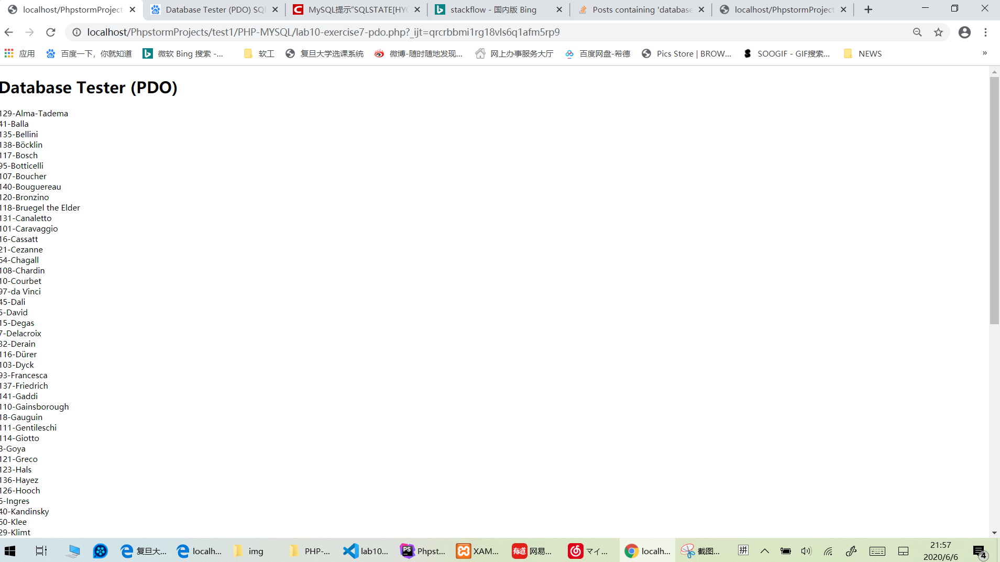

# Lab10


## Exercise7: MYSQL THROUGH PHP  

1. PDO
   
2. mysqli
 
3. PDO
```html
// 导入部分定义好的数据
<?php require_once ('config.php'); ?>

<!DOCTYPE html>
<html>
<body>
<h1>Database Tester (PDO)</h1>
<?php
try{

    # 建立连接: 通过dsn(mysql:dbname=art;charset=utf8mb4;), username, password 新建pdo对象
    $pdo = new PDO(DBCONNSTRING, DBUSER, DBPASS);

    # 设置出现错误时处理模式 PDO::ERRMODE_EXCEPTION 抛出异常
    $pdo->setAttribute(PDO::ATTR_ERRMODE,PDO::ERRMODE_EXCEPTION);

    $sql = "select * from Artists order by LastName;";//查询语句

    # PDO::query($查询语句) 成功->返回PDOStatement对象; 失败->FALSE
    $result = $pdo->query($sql);// 查询结果集

    # PDOStatement::fetch 从结果集$result中获取下一行
    while($row = $result->fetch()){
        echo $row['ArtistID'] . "-" . $row['LastName'] . "<br/>";
    }
    
    //释放内存,断开连接
    $pdo = null;
}catch (PDOException $e){
    die( $e-> getMessage());

}

?>
</body>
</html>
```
4. mysqli
```html
// 导入部分定义好的数据
<?php require_once ('config.php');?>

<!DOCTYPE html>
<html>
<body>
<h1>Database Tester (mysqli)</h1>
Genre:
<select>
    <?php
    # 创建与数据库的连接：localhost,username, password, art
    $connection = mysqli_connect(DBHOST, DBUSER, DBPASS, DBNAME);

    # mysqli_connect_error() 返回上一次连接 $connection 错误的错误描述
    # mysqli_connect_errno() 返回上一次连接 $connection 错误的错误代码
    # 若 Mysql 连接出错,输出错误信息，退出脚本，相当于exit(status);
    if( mysqli_connect_errno()){
        die(mysqli_connect_error());
    }
    // 查询表 Genres 中所有元组，按照GenreName排序
    $sql = "select * from Genres order by GenreName;"; 

    # mysqli_query($连接, $查询语句) SELECT查询返回mysqli_result对象
    if( $result = mysqli_query($connection, $sql)){ // 得到结果集

        # 从结果集$result中取得一行作为关联数组$row
        while($row = mysqli_fetch_assoc($result)) { //从集合中取元组
            echo '<option value="' . $row['GenreID'] . '">';
            echo $row['GenreName'];
            echo "</option>";
        }
        # mysqli_free_result($结果集) 释放结果集
        mysqli_free_result($result);
    }

    // close the db connection
    mysqli_close($connection);

    ?>
</select>
</body>
</html>
```

## Exercise8: INTEGRATING USER INPUTS (PDO)  
1. 
 

2. 
```php
function outputArtists(){
    try {
        $pdo = new PDO(DBCONNSTRING, DBUSER, DBPASS);
        $pdo->setAttribute(PDO::ATTR_ERRMODE, PDO::ERRMODE_EXCEPTION);

        // 搜索表artists所有元组，依据lastname排序，记录1-30行
        $sql = "select * from Artists order by LastName limit 0,30";
        $result = $pdo->query($sql);
        while ($row = $result->fetch()) {
            # $_SERVER['SCRIPT_NAME'] 返回当前脚本的路径
            # 添加指向每个作家页面的链接：href= $当前路径 + ’?id=’ + $查询结果作者id;
            echo '<a href="' . $_SERVER["SCRIPT_NAME"] . '?id=' . $row['ArtistID'] . '" class="';

            # isset（$var）函数 检测变量是否设置
            # PHP中，预定义的 $_GET 变量用于收集来自 method="get" 的表单中的值
            # 根据当前url中？之后的id改变class
            // 若 id 已经设置且等于当前作者的 id ，class 为 active
            if (isset($_GET['id']) && $_GET['id'] == $row['ArtistID']) echo 'active ';
            echo 'item">';
            echo $row['LastName'] . '</a>';
        }

        $pdo = null;
    } catch (PDOException $e) {
        die($e->getMessage());
    }

}
```

   ```php
   function outputPaintings(){
    try {
        
        if (isset($_GET['id']) && $_GET['id'] > 0) { 
            $pdo = new PDO(DBCONNSTRING,DBUSER,DBPASS);
            $pdo->setAttribute(PDO::ATTR_ERRMODE, PDO::ERRMODE_EXCEPTION);
            
            // 查询表 paintings 中，id = 页面 url 中所指 id ，的所有元组
            $sql = 'select * from Paintings where ArtistId=' . $_GET['id'];
            $result = $pdo->query($sql);
            
            // 对该作者id下所有图片逐行打印
            while ($row = $result->fetch()) {
                outputSinglePainting($row);
            }

            $pdo = null;
         }
    }catch (PDOException $e) {
        die( $e->getMessage() );
    }

}

   ```  

## Exercise9: PREPARED STATEMENTS  
1. 
```php
# :var 预备语句，相当于留空位方便后面填上
//在表 Paintings 中查询满足id= ? 的所有tuples
$sql = 'select * from Paintings where ArtistId=:id';
$id = $_GET['id'];

# PDO::prepare — 准备 将要执行的SQL语句 并返回一个 PDOStatement 对象
$statement = $pdo->prepare($sql);
# PDODtatement 对象绑定待定值
$statement->bindValue(':id', $id);
# PDODtatement 对象执行查询语句
$statement->execute();

/* 
 * //或者第二种方法不用bindValue()
 * $statement = $pdo->prepare($sql);
 * $statement->execute(Array(':id' => $id));
*/
```

## [Optional] Exercise10: HTML LIST AND RESULTS  
1. 


2. 
```php
function outputGenres() {
    try {
        // 新建PDO对象，连接数据库
        $pdo = new PDO(DBCONNSTRING,DBUSER,DBPASS);
        $pdo->setAttribute(PDO::ATTR_ERRMODE, PDO::ERRMODE_EXCEPTION);

        // 从表 Genres 中查询GID GNAME DESC ，并依据 GID 排序 
        $sql = 'select GenreId, GenreName, Description from Genres Order By GenreID';
        $result = $pdo->query($sql);

        while ($row = $result->fetch()) {
            outputSingleGenre($row);
        }
        $pdo = null;
    }catch (PDOException $e) {
        die( $e->getMessage() );
    }
}
```
```php
function outputSingleGenre($row) {
    echo '<div class="ui fluid card">';
    echo '<div class="ui fluid image">';
    $img = '';
    // 根据查询结果的 GID 和生成的 img 创建指向详情页的链接
    echo constructGenreLink($row['GenreId'], $img);
    echo '</div>';
    echo '<div class="extra">';
    echo '<h4>';
    // 根据查询结果的 GID 和GName创建指向详情页的链接
    echo constructGenreLink($row['GenreId'], $row['GenreName']);
    echo '</h4>';
    echo '</div>'; // end class=extra
    echo '</div>'; // end class=card
}
```