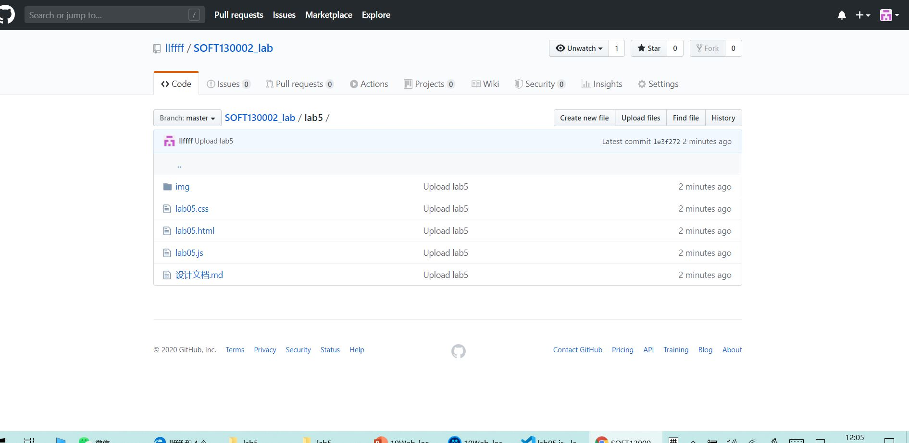
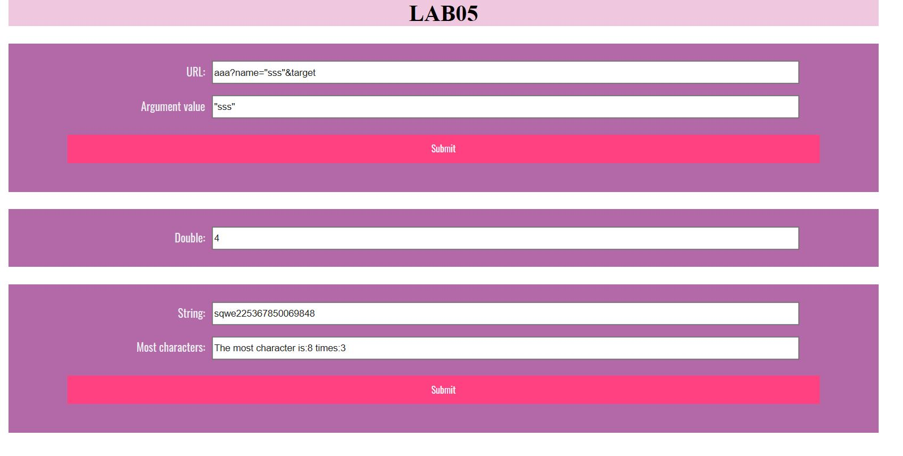

# Lab5设计文档

## 函数相关知识点与解决方案

#### 1. 获取url中名为name的参数

使用字符串的`indexOf(str)`函数匹配`name`的值的下标； 
使用字符串的`substring(index1,index2)`函数提取`name`的值并显示；

---

#### 2.1 每隔五秒运行一次函数

使用`let clock = self.setInterval(timeTest, 5000)`设定时间间隔为5000ms，每隔5秒执行一次`timeTest`函数 

#### 2.2 直到某一整分钟停止

使用`new Data().getSeconds()`函数记录开始时的分钟数，每次执行`timeTest`时调用检测当前时间是否仍处于同个分钟内；若不是，使用`clearInterval(clock)`取消定时；

#### 2.3 或运行10次停止

使用变量`count`计数，并在if语句判断条件中添加 `&& count < 10`

---

#### 3. 判断并统计输入框most里出现最多的字符

创建元素数组array：for循环遍历string，生成不重复的元素字符数组array； 
`相关函数：` 
    `array.indexOf(str[i]) === -1;`  
    `array.push(str[i]);`  
创建计数数组count：与array同等大小，for循环遍历string每个字符，在count中将该字符在array中对应位置+1； 
`相关函数：` 
    `let count=new Array(array.legnth);` 
    `count.fill(0);` 
    `count[array.indexOf(str[j])]++;` 
取count中最大的计数，显示结果

---

## 截图

### github截图

### 完成网页效果截图

