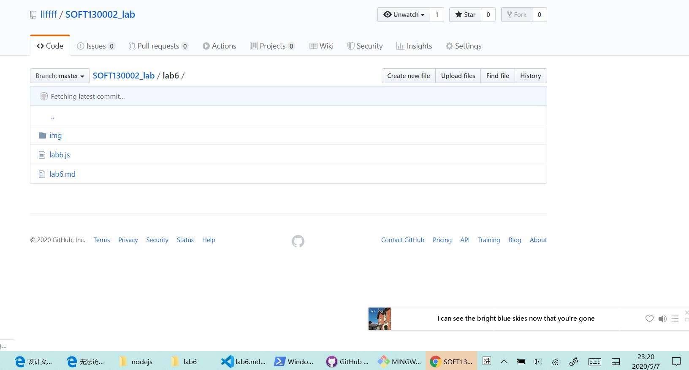
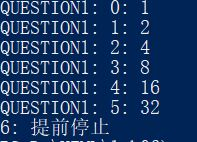

# Lab6设计文档


## 各个正则表达式的解释
1. 第二题邮箱正则表达式

     var reg_mail = /^([a-z]|[A-Z]|[0-9])(\w|\-)+@[a-zA-Z0-9]+((\.[a-zA-Z]{2,4}){1,2})$/;

     > a. ^([a-z]|[A-Z]|[0-9]) 匹配开头为字母或数字<br>
     b. (\w|\-)+ 匹配若干位字母、数字、下划线、-<br>
     c. @ 匹配@<br>
     d. [a-zA-Z0-9]+ 匹配若干位字母或数字 `如fudan`<br> 
     e. ((\.[a-zA-Z]{2,4}){1,2})$ 匹配结尾为1个或2个`.xxx`后缀 `如.edu.cn 或.com`<br>

2. 第三题重复连续单词

     var reg_str = /\b([a-z]+) \1\b/gi;

     >a. \b 匹配一个单词的边界 <br>
     b. ([a-z]+) 匹配一个单词与空格<br>
     c.  \1 表示第一个匹配单元<br>
     d. \b 匹配单词结尾<br>

## 对map的理解和使用
1. map.has(key)、 map.set(key,value) 、以及map的初始化
```
function twoSum(nums, target) {
    var map_sum = new Map();
    for( let i = 0 ; i < nums.length ; i++){
        var i_minus = target - nums[i];

        if(map_sum.has(nums[i]+""))
            console.log("["+map_sum.get(nums[i]+"")+","+i+"]");
        else        
            map_sum.set(i_minus+"",i);
    }
}
```

```
function lengthOfLongestSubstring(str) {
    var map_test = new Map();
    var longest_length = 0;

    for (let left_index = 0, right_index = 0; right_index < str.length;) {
        if (map_test.has(str.charAt(right_index)))
            left_index = map_test.get(str.charAt(right_index)) + 1;
        map_test.set(str.charAt(right_index), right_index);
        right_index++;

        if ((right_index - left_index) > longest_length)
            longest_length = right_index - left_index;
    }
    console.log(longest_length);
}
```

## github截图



## 完成的本地命令行截图
<br>


