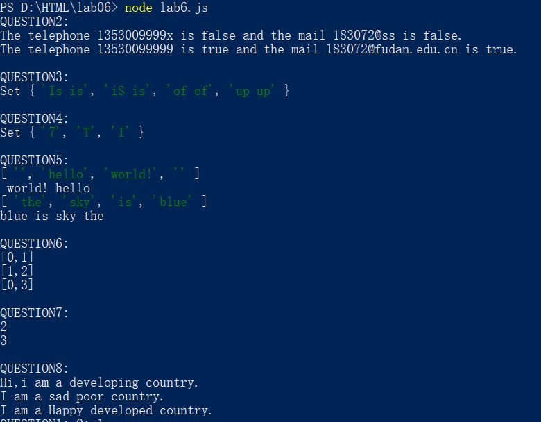

# Lab6设计文档

## 各个正则表达式的解释
1. 第二题邮箱正则表达式

     var reg_mail = /^([a-z]|[A-Z]|[0-9])(\w|\-)+@[a-zA-Z0-9]+((\.[a-zA-Z]{2,4}){1,2})$/;

     > a. ^([a-z]|[A-Z]|[0-9]) 匹配开头为字母或数字 
     b. (\w|\-)+ 匹配若干位字母、数字、下划线、- 
     c. @ 匹配@ 
     d. [a-zA-Z0-9]+ 匹配若干位字母或数字 `如fudan`  
     e. ((\.[a-zA-Z]{2,4}){1,2})$ 匹配结尾为1个或2个`.xxx`后缀 `如.edu.cn 或.com` 

2. 第三题重复连续单词

     var reg_str = /\b([a-z]+) \1\b/gi;

     >a. \b 匹配一个单词的边界  
     b. ([a-z]+) 匹配一个单词与空格 
     c.  \1 表示第一个匹配单元 
     d. \b 匹配单词结尾 

## github截图

## 完成的本地命令行截图
 

